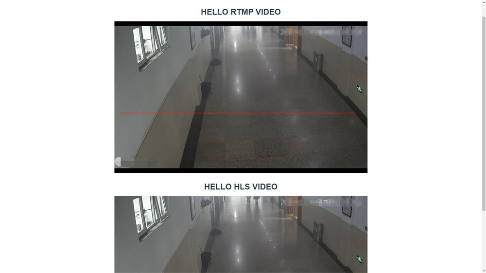

# video_monitor

> RTMP视频流播放

## Build Setup

``` bash
# install dependencies
npm install

# serve with hot reload at localhost:8080
npm run dev

# build for production with minification
npm run build

# build for production and view the bundle analyzer report
npm run build --report
```

## 如需单独安装
````
npm install vue-video-player videojs-flash videojs-contrib-hls --save
````

## 注意事项
* 安装完成后能在package.json里查看到版本号
````
    "vue-video-player": "^5.0.2",
    "videojs-flash": "^2.2.1",
````
* 引用包的先后顺序
````
  // require styles
  import 'video.js/dist/video-js.css' // 引入样式
  import 'vue-video-player/src/custom-theme.css' // 引入样式
  // video-player
  import { videoPlayer } from 'vue-video-player'
  // rtmp video-flash
  import 'videojs-flash'
````
* rtmp地址后面/斜杠问题
> 如rtmp://192.168.142.70:1935/Vehicle
  在项目中需要写成rtmp://192.168.142.70:1935/Vehicle/
* 安装vue-video-player插件一定要用npm安装，不可使用cnpm安装

`否则会报:“The "flash" tech is undefined. Skipped browser support check for that tech”`
* 如果需要播放 RTMP 流，需要安装 videojs-flash 插件
* 如果需要播放 HLS 流，需要安装 videojs-contrib-hls 插件，非原生支持的浏览器，直播服务端需要开启 CORS
> 本地需测试使用devServer.proxy代理，绕过CORS问题，具体配置地址：config\index.js，修改proxyTable参数即可

`代理地址如：http://d2zihajmogu5jn.cloudfront.net/bipbop-advanced/bipbop_16x9_variant.m3u8`
````
proxyTable: {
      '/bipbop-advanced': {
        target: 'http://d2zihajmogu5jn.cloudfront.net/',
        changeOrigin: true,
        ws: false
      },
    },
````
`注意：修改代理配置后，需要重新运行项目：npm run dev`
* 如果RTMP、HLS两个流都需要播放，flash 插件需要安装到 hls 插件之前
* 如果你需要在谷歌浏览器播放，需要将谷歌浏览器的flash设置改成允许使用flash插件播放
## 预览效果

